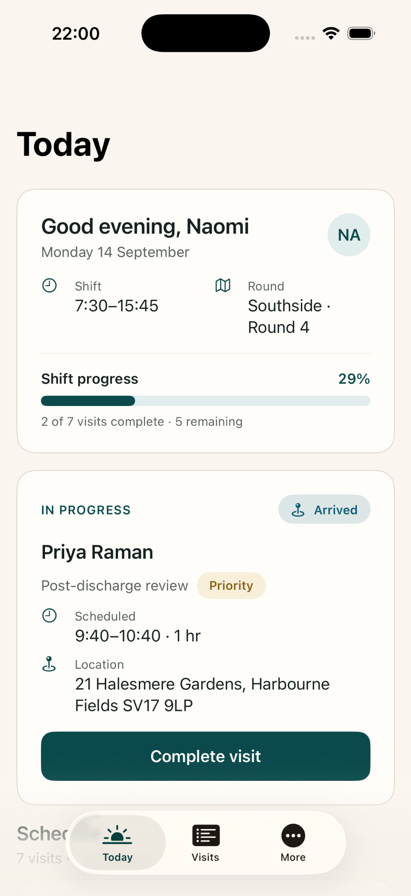
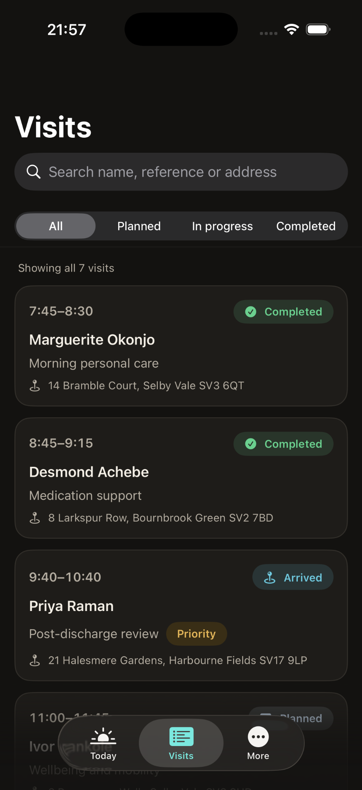
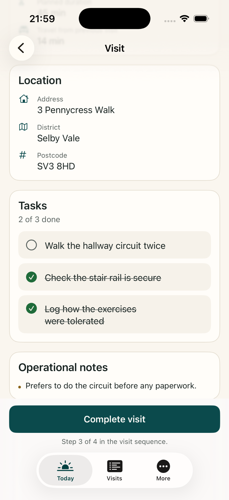
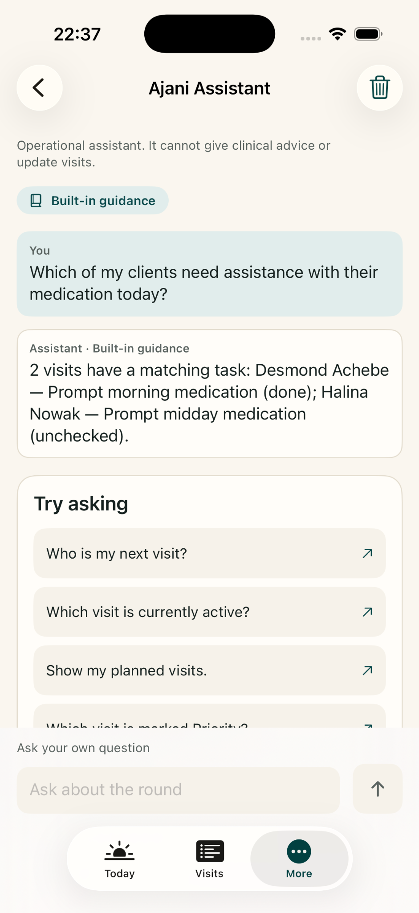
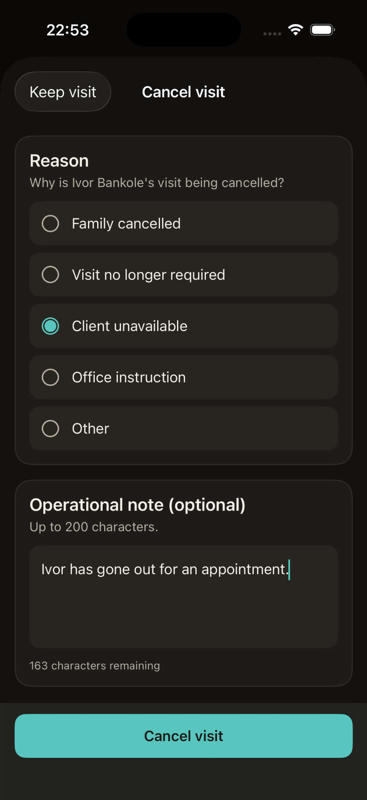
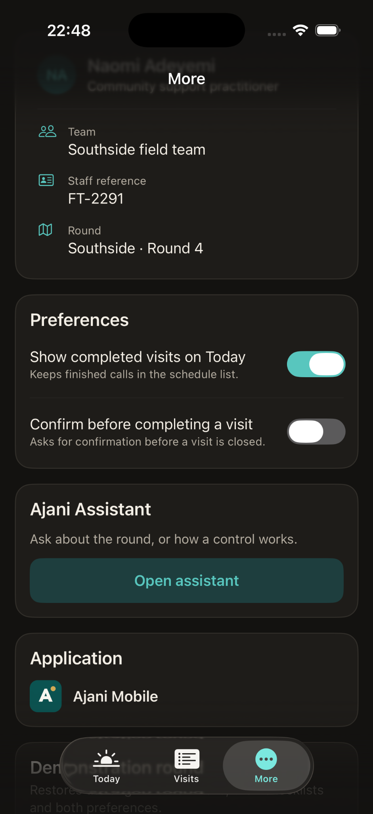

# Ajani Field Operations

**Ajani Field Operations** is a community healthcare operations product for practitioners who
work a daily round of visits. Its iPhone application is named **Ajani Mobile** — a native
SwiftUI app targeting iOS 18 and later, built for the phone in a worker's pocket between
calls: a clear view of the shift ahead, the visit in front of them, and the few actions that
move that visit forward.

[Product overview](https://www.ajanihealthcare.com/products/ajani-mobile) ·
[Interactive demo](https://www.ajanihealthcare.com/products/ajani-mobile/demo)

## Screens

Native iPhone captures using demonstration data.

|  |  |
|:---:|:---:|
| <br>**Today** — Shift overview, progress and active visit | <br>**Visits** — Searchable schedule and operational statuses |
| <br>**Visit detail** — Task completion and operational notes | <br>**Ajani Assistant** — Questions answered from the recorded round using built-in guidance |
| <br>**Cancel visit** — Reason selection and an operational note | <br>**More** — Preferences, Assistant access and application identity |

## What it does

**Today** — a shift dashboard with a greeting, the shift window and round, and progress
through the day. An "Up next" card surfaces the visit needing attention, with its scheduled
time, location and a single action to advance it. Below that, the full schedule in
chronological order with planned, in-progress and completed states.

**Visits** — the same schedule with live search across client name, visit reference, visit
type and address, plus filtering by All, Planned, In progress and Completed. Searches that
match nothing show a considered empty state rather than a blank screen.

**Visit detail** — reference, client, visit type and status; scheduled window, planned
duration and travel time from the previous call; the address; a tappable task checklist; and
operational notes. A single primary action moves the visit through its journey:
Planned → En route → Arrived → Completed. The checklist unlocks on arrival, a visit that
has not started can be cancelled against a recorded reason, and a visit begun by mistake can
be returned to Planned.

**Ajani Assistant** — an operational assistant, reached from More, that answers questions
about the round in front of the practitioner: who is next, which visits are planned after
midday, whose checklist still has work on it, what a task records, and how a control in the
app behaves. It reads a copy of the round and cannot change anything. Answers come from the
recorded round and built-in guidance, and a remote provider can optionally be configured to
phrase them; each reply states which of the two answered it. It is not a clinical
decision-making system: it will not advise on symptoms, medication, dosage or treatment, and
refers those to the practitioner's own policy and escalation process.

**More** — the practitioner's profile and round, access to the Assistant, two preferences that
genuinely change the interface, application information, and a control that restores the
demonstration round.

## Engineering highlights

- **Validated state transitions.** A visit advances Planned → En route → Arrived → Completed.
  The rules live in the domain layer, so a stage cannot be skipped or reversed, and the
  interface only ever offers the action that is actually available.
- **Workflow protections.** One visit can be in progress at a time, and starting a second is
  refused rather than silently allowed. Checklists are read-only until the practitioner
  arrives. Completing a visit with tasks still outstanding asks first and says how many.
  Cancellation records a reason — and a note, which the app requires for "Other" — without
  touching the checklist, and an en route visit can be returned to Planned with confirmation.
- **Search and filtering.** Case- and diacritic-insensitive matching across four fields,
  combined with status filtering, resolved in one place and reused by both screens.
- **Task completion.** Checklist items are ticked off against the visit and counted back into
  the header, so progress within a call is visible at a glance.
- **Preference-driven behaviour.** Both settings change what the app does: one hides completed
  visits from Today, the other requires confirmation before a visit is closed.
- **Responsive Dynamic Type.** System text styles throughout, scaled metrics for icon and
  avatar dimensions, and layouts that reflow from a row into a stack — the shift summary and
  the visit row's time and status badge — once the text outgrows the available width.
- **Dark appearance.** A single set of adaptive design tokens drives both appearances, as the
  Visits and More screens above show.
- **Reduced Motion.** Honoured at both animation sites, so the interface stops moving for
  people who ask it to.
- **Accessibility identifiers.** A single source of truth shared by the app and the UI tests,
  alongside VoiceOver labels and values on interactive elements and comfortable touch targets.
- **Domain separation.** The core visit and scheduling rules are plain Swift with no SwiftUI
  dependency, and take their date and calendar context as parameters, so the tests stay
  deterministic.
- **A reader that cannot write.** The Assistant answers from a value copy of the round and
  holds no mutating reference to the shared state, so it can describe the shift but never
  change it. Requests for clinical advice, for the app's own configuration, or to perform an
  action are recognised and answered locally, and are never sent to a remote provider.
- **Automated tests.** 348 unit tests across 48 suites, plus 33 UI tests covering launch, tab
  navigation, opening a visit, the full status journey, cancellation and return, task locking,
  completion safeguards, search, the navigation chrome, and the Assistant's answers and
  boundaries.

## Architecture

State lives apart from presentation. Because the domain layer takes its dates and calendars as
parameters, the tests construct exactly the shift they need without touching the wall clock.

```
AjaniFieldOperations/
├── App/            Entry point and the Today / Visits / More tab structure
├── DesignSystem/   Colour, spacing and radius tokens; cards, badges, controls
├── Domain/         Visit, task, worker and shift models; ordering, progress,
│                   next-visit, search and status-transition rules
│   └── Assistant/  Question reading, record selection, answers and boundaries;
│                   the remote provider behind a protocol
├── Data/           Demonstration records
├── State/          FieldOperationsStore and AssistantConversation — the shared,
│                   observable shift and conversation state
├── Features/       Today, Visits, More and Assistant screens
├── Components/     Views shared across features
└── Support/        Formatting, app metadata, accessibility identifiers
```

`FieldOperationsStore` is an `@Observable`, `@MainActor` class injected through the SwiftUI
environment. It owns the shift and validates every change; views read from it and call it, and
never hold their own copy of a visit. `AssistantConversation` sits beside it and is given a
read-only snapshot of the round, so the Assistant has no route back to the state it describes.
The remote provider sits behind a protocol, which is what lets the transport be tested against
a stub rather than a network.

## Technology

- Swift and SwiftUI, using the Observation framework for shared state
- Swift Testing for unit tests, XCTest and XCUITest for UI tests
- Apple frameworks only — no third-party dependencies

## Building and testing

An iPhone application targeting iOS 18.0 and later. Built and tested with Xcode 26.6.

```bash
open AjaniFieldOperations/AjaniFieldOperations.xcodeproj
```

Select an iPhone simulator and run with ⌘R, or test with ⌘U. From the command line:

```bash
cd AjaniFieldOperations

# Build
xcodebuild -project AjaniFieldOperations.xcodeproj \
  -scheme AjaniFieldOperations \
  -destination 'platform=iOS Simulator,name=iPhone 17' build

# Unit and UI tests
xcodebuild -project AjaniFieldOperations.xcodeproj \
  -scheme AjaniFieldOperations \
  -destination 'platform=iOS Simulator,name=iPhone 17' test
```

## Current scope

The application runs against generated demonstration records held in memory for the duration
of a launch, so the workflows above can be built and exercised end to end. Every name, address
and note is fictional. The Assistant's remote endpoint is read from a configuration value
rather than compiled in, and holds no credential; with none configured, or when it cannot be
reached, the built-in answers stand.

## Planned direction

- Persistence, so a shift survives relaunch and edits made between calls are kept
- A backend for schedules and visit records, with synchronisation and conflict handling
- Authentication and per-practitioner authorisation
- Routing between calls, with travel estimates from real positions
- Visit notes captured on site, including photographs and structured observations
